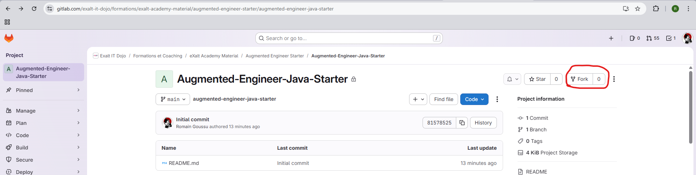
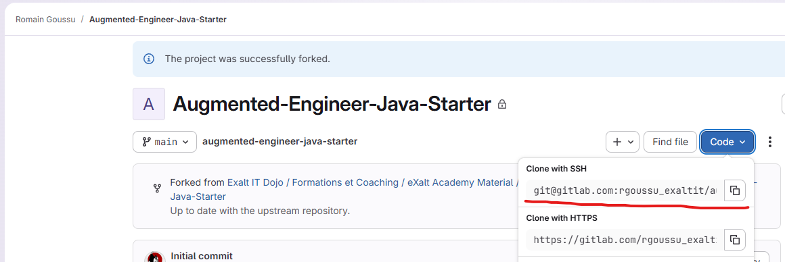
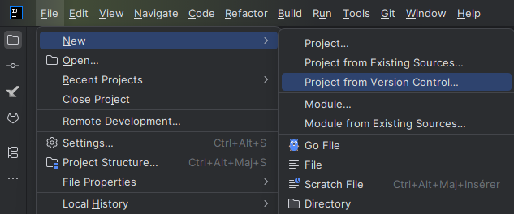

# Casa Bel'Aire: construir un backend para el bar de bebidas y snacks del famoso festival eXalt. Con Java, IA y amor.

Versión original: [README.md](README.md)

>[!note]
> 
> Este proyecto forma parte del itinerario de aprendizaje de ingeniero aumentado eXalt IT, disponible en su [academy](https://example.com).

¡Hola y bienvenido al repositorio del proyecto La Buvette de Bel'Air!

Este proyecto es tu campo de pruebas para crear un sistema backend robusto para gestionar las bebidas y los snacks.

Vas a construir el backend más fantástico usando Java.

Pero, lo más importante, tu nuevo mejor amigo: GitHub Copilot, tu nuevo patito de goma / becario sobreentusiasta para programar en pareja.


## Para empezar

Primero, haz un fork de este repositorio a tu propia cuenta de Gitlab:



>[!warning]
> 
> ¡Haz fork solo de la rama main!

Luego clónalo en tu máquina local usando IntelliJ (o tu terminal si quieres sentirte como un hacker):

### IntelliJ

Obtén la URL de tu repositorio fork desde Gitlab:



Luego en IntelliJ, ve a `New`, `Project from version control`, haz clic y pega la URL que acabas de copiar en el campo correspondiente.



### Terminal

```bash
git clone <LA_URL_DE_TU_FORK_git>
cd belairs-buvette
```

Después abre la carpeta en IntelliJ (`New` -> `Project from existing sources`).

### Espejar en GitHub

Para poder usar correctamente las funciones de IA más avanzadas con Copilot, espeja también este repositorio en tu cuenta de GitHub.

Primero crea un nuevo repositorio vacío en GitHub llamado `belairs-buvette`.

Luego añade el remote de GitHub a tu configuración git local:

```bash
git remote add github  <la_URL_de_tu_nuevo_repositorio_GitHub>
git branch -M main
git push -u github main
```

¡Ya estás listo!

Para compilar el proyecto, puedes usar el wrapper de Gradle incluido en el proyecto.

```bash
./gradlew build
```

Para ejecutar las pruebas del proyecto, puedes usar el siguiente comando:

```bash
./gradlew test
```

¡Feliz codificación!

